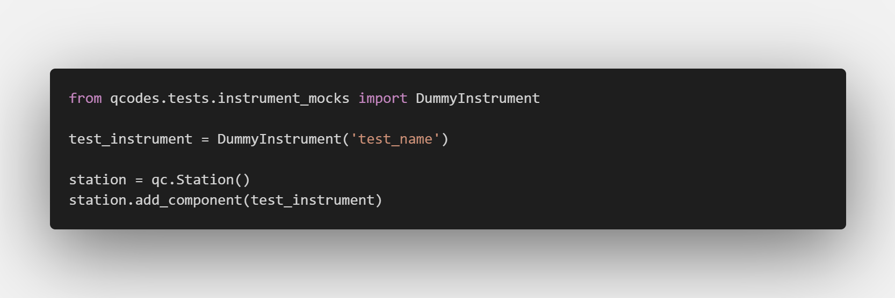
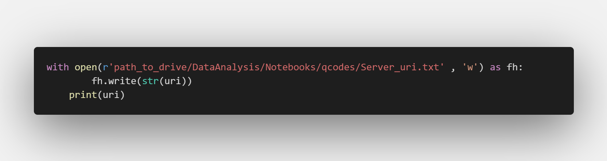
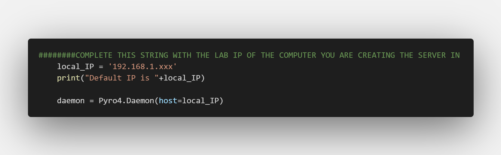

This python projects consists of two different files. The most important file you'll want to take into account is the server.py file, which allows you to create a Remote server on a computer to use with Qcodes.

In order to install the server.py file, follow the next steps:

- Git clone this repository to a folder, and cd to it
- Create a new environment `conda create -n server` and activate it using `conda activate server`
- Install all the dependencies on the server side using `pip install -r requirements.txt`. This installation includes our version of qcodes.
<!-- - Make sure to install qcodes from our sqdlab repository to access all our instruments. Follow the instructions on [https://github.com/sqdlab/Qcodes](https://github.com/sqdlab/Qcodes) or on our [Wiki](https://wiki.smp.uq.edu.au/EQuS-SQDLab/index.php/Software_Manual) (request access if not yet allowed) -->

Use of the server is as follows:
- First open the python file in a text editor. Inspect the file, create instances of all the instruments you need, and add all the instruments to the station object

- Toggle the comment on the following line, and give the appropriate path and filename. This line creates a new file inside the group's share drive which is required in order to read the uri of the server

- Change the local_IP inside the code to the local lab IP of the computer you are opening the remote server in

- Now open an Anaconda terminal and make sure you are in the same folder as the code for the server script.
- Double check that you are in the server environment, and run `python server.py`
- This should create the server so that it runs in this terminal. Now you can access this server by its uri.